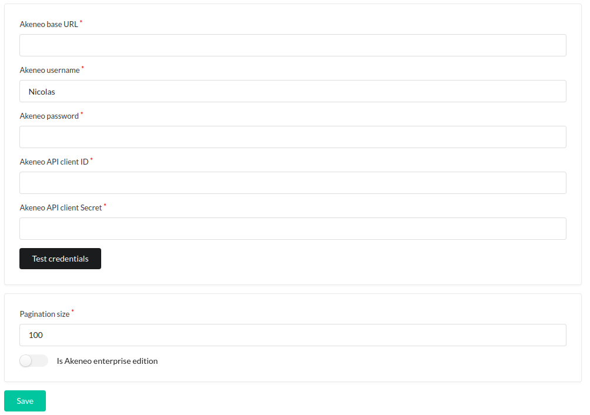

# Configure your Akeneo Account

## Akeneo authentication

You must be authenticated to the Akeneo API to use this plugin.

If you don't have any client id, please take a look at [this page](https://api.akeneo.com/documentation/authentication.html#client-idsecret-generation) to create it.

## Configure authentication in the plugin

* Login as administrator in your Sylius Back-office
* Go to menu Akeneo > Api configuration
* Set you credentials and save it (you can test it, if needed)
* The pagination allows you to make larger or smaller requests for the recovery of Akeneo data. The maximum value is 100.

---

Next step: [Advanced configuration](CONFIGURE_DETAIL.md)
