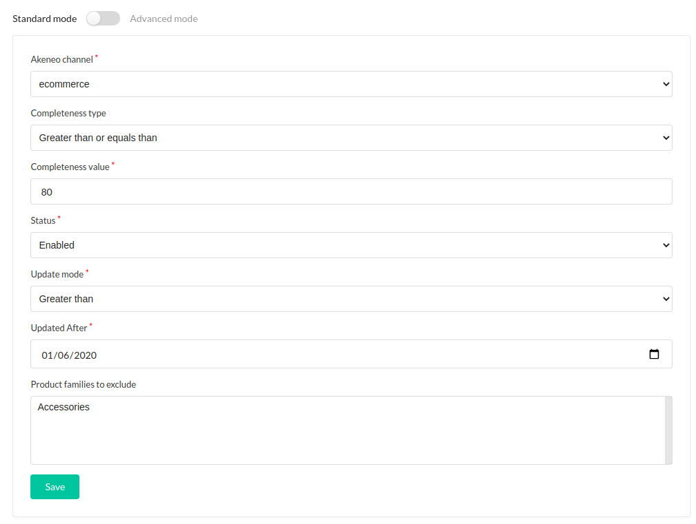
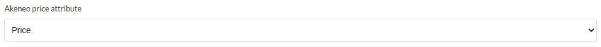
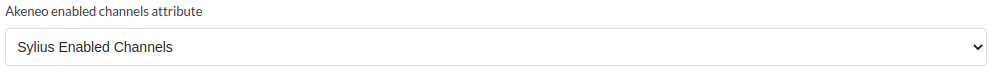
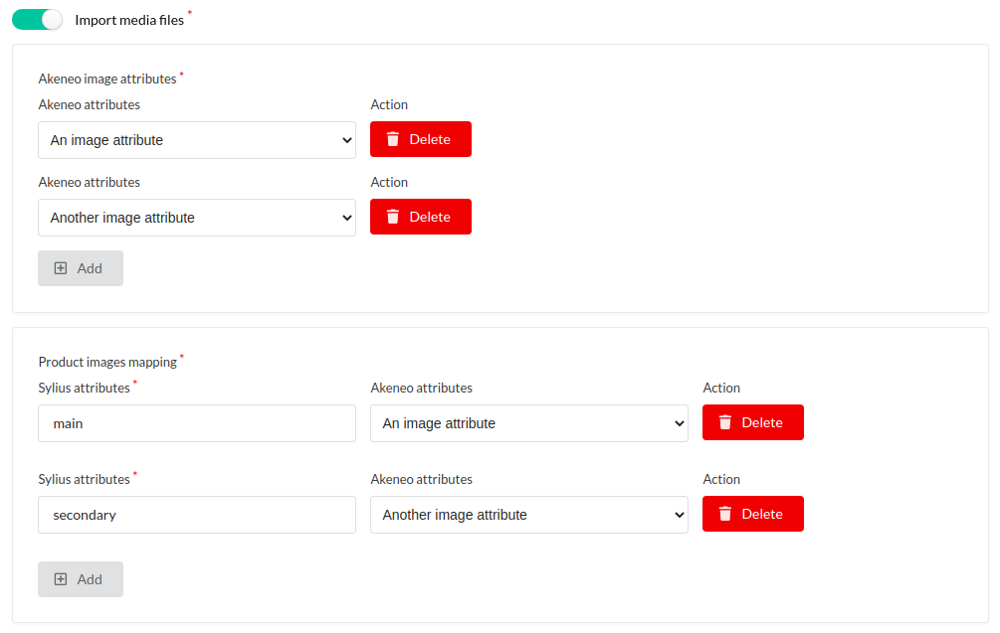
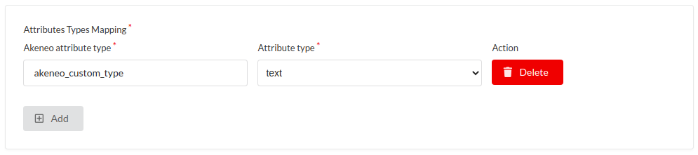
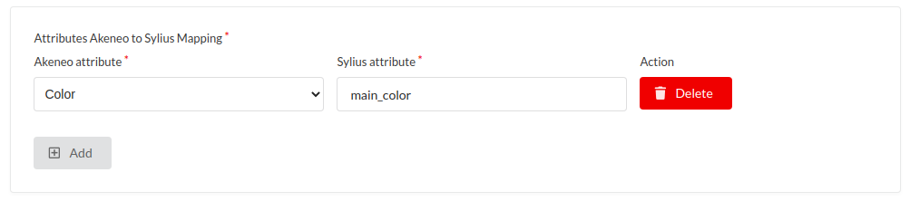

# Advanced configuration

## Product filter rules

    BO > Akeneo > Product filter rules

You can configure filters to select which products will be imported. 

You can also configure filters as advanced mode, with this, you can create your own query for
this request /api/rest/v1/products

Product filters Akeneo documentation: https://api.akeneo.com/documentation/filter.html

## Categories

    BO > Akeneo > Categories

The category import configuration contains two multi-selects, the first allows you to select the categories that you want to include and the second the categories that you want to exclude from the import. In either case, **selecting a parent will exclude the parent and its children**.

## Products

    BO > Akeneo > Products

### Akeneo Price Attribute Mapping

Allows you to select the attribute that will be used to define the price of the imported product.
This attribute must be of type **pim_catalog_price_collection** in Akeneo.

### Akeneo Type to Sylius Type Mapping

Allows you to select the attribute that will be used to obtain information on which channels the products will be activated on.
This attribute must be of type **pim_catalog_multiselect**.

### Import media images for products

Media import is authorized by checking the **Import media files** box, then two new configurations will be displayed.

#### Akeneo image attributes

This is used to define which attributes we want to use to import images on our product.

#### Product images mapping

This configuration is not mandatory and is used to define a special code according to the attribute of the imported image. 
This make it possible to differentiate a main image from a secondary one, for example. This does not concern the attributes of type Asset, because this functionality is not yet developed.

## Attributes

    BO > Akeneo > Attributes

### Map attribute types manually

This configuration will generally not be used, because the Akeneo module from Synolia is able to automatically detect the correct type of the attribute if it is a standard Akeneo attribute. However, it can be used to map custom attributes that might have been done on Akeneo to an attribute type of Sylius.

### Map Akeneo attributes to Sylius attributes of a different code

This part allows you to manually map an Akeneo attribute to a Sylius attribute by indicating the attribute code on each of the solutions. Useful if the code of an attribute differs between Sylius and the PIM.

---

Previous step: [Initial configuration](CONFIGURE.md)

Next step: [Customization](CUSTOMIZE.md)
