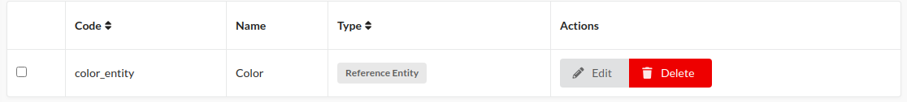
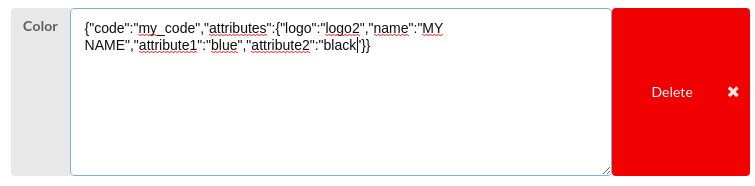

# Everything you need to know about Reference Entity in Sylius

## How are they stored?

### On ProductAttribute entity

The attribute configuration is stored as normal attribute. The configuration contains all the available values and their translations.

### On ProductAttributeValue entity

The value we store in the json_value column is the raw value given by Akeneo when requesting the endpoint:
`/api/rest/v1/reference-entities/{{ reference_entity_code }}/records/{{ record_value }}`

## How to find/edit them

### On the product attribute listing

Reference entities are identifiable by their special type **Reference Entity**. 

### On the product show page (FO and BO)

By their special type of beeing an attribute of attributes we decided to only show the code value of the reference entity on the attributes grid.

Therefore, if you would like them to be displayed another way, you can edit the reference entity template `src/Resources/views/SyliusAttributeBundle/Types/reference_entity.html.twig`.

### On the product edition page (BO)

You can edit your reference entities values on the attribute edition form. 
They are displayed as raw JSON and you can edit them the way you want but be sure to keep the code node if you haven't customized the twig view. 

### On the API

Since they are stored as JSON, you will get exactly what Akeneo is giving US when requesting the endpoint:
`/api/rest/v1/reference-entities/{{ reference_entity_code }}/records/{{ record_value }}`

